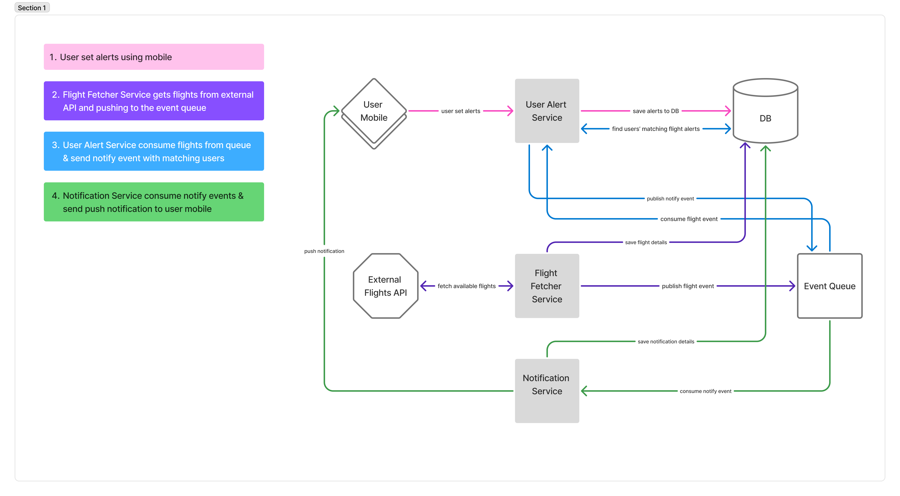

# Flight Alert Notification System

This project is a backend system for tracking flight deals and notifying users when prices match their saved alerts. It's built using ASP.NET Core and RabbitMQ with a clean, event-driven architecture.

---

## System Overview

The system consists of the following services:

- **Mobile Client** – where users create flight alerts
- **AlertService** – stores alerts and matches them to flight deals
- **FlightFetcher** – scrapes or fetches real-time flight prices and publishes them
- **Event Queue** – connects services using asynchronous messaging (RabbitMQ)
- **NotificationService** – delivers push notifications to users when a match is found

---

## Architecture Diagram



---

## Example Flow

1. **User Sets Alert**  
   A user opens the mobile app and creates a flight alert:
   - Route: **JFK → LAX**
   - Date: **April 15**
   - Max Price: **$250**

   The mobile app sends this data to the backend, where it's stored in the database via the `AlertService`.

2. **Flight Deal Found**  
   The `FlightFetcher` service finds a new flight:
   ```json
   {
     "flightId": "DL123",
     "from": "JFK",
     "to": "LAX",
     "departureDate": "2025-04-15",
     "price": 249.99,
     "airline": "Delta",
     "foundAt": "2025-04-04T13:45:00Z"
   }
   ```
   It publishes this deal to the event queue.

3. **AlertService Matches the Deal**  
   `AlertService` subscribes to flight deal events. Upon receiving this one, it queries its database and finds that the user’s alert criteria match this flight.  
   It then publishes a new event:
   ```json
   {
     "flightId": "DL123",
     "message": "🚨 Deal: JFK → LAX for $249.99 on April 15!",
     "users": [
       {
         "userId": 123,
         "deviceToken": "abc123xyz"
       }
     ]
   }
   ```

4. **NotificationService Sends Push**  
   The `NotificationService` consumes this alert match event and sends push notifications to the user's mobile device.

---

## Getting Started

To run this project, make sure you have the following installed on your machine:

- [.NET 8 SDK](https://dotnet.microsoft.com/en-us/download)
- [PostgreSQL](https://www.postgresql.org/download/)
- [RabbitMQ](https://www.rabbitmq.com/download.html) (can be run locally or via Docker)

